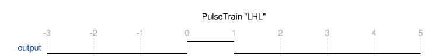
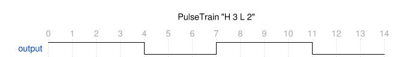
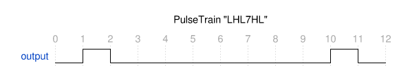

# rp2040-circuitpython-pulsetrain

This is an experimental CircuitPython module for simpler generation 1-pin pulse trains.

This implementation uses RP2040's PIO, so only runs on RP2040.

```
import pulsetrain

pt = pulsetrain.PulseTrain(board.GP0, 1_000_000) # 1 Mhz

# A single high 1us pulse
pt.drive("L H L")
```



```
# 8 pulses with a 3:2 duty cycle, 5 us cycle time, repeat forever
pt.loop("H 3 L 2" * 8)
```



```
# A low-high-low pulse, 7 us delay, then high-low
pt.drive("L H L 7 H L")
```


